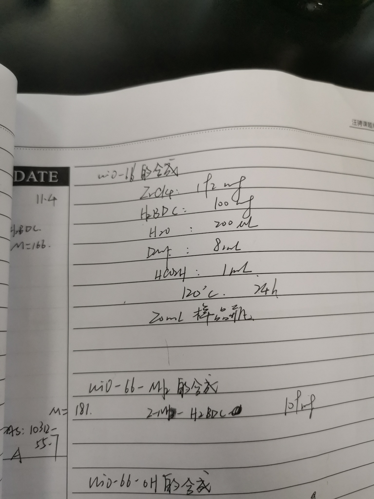

## Human:

I performed the following synthesis for UIO-66: "Synthesis and characterization of UiO-66 and UiO-66(NH2): UiO-66 has been prepared following the procedure described by Cavka et al.21 ZrCl4 (53 mg, 0.227 mmol) and 1,4-benzenedicarboxylic acid (34 mg, 0.227 mmol) were dissolved in DMF (25 mL), and the solution was heated inside an autoclave at 120 °C for 48 h. After this time, the autoclave was cooled to room temperature in air (natural cooling). The recovered solid was washed with DMF and dried at room temperature under reduced pressure.\nNotes: None". However, I did not get any products. Can you search for the relevant topic and give me advice on how to modify the synthesis?

## AI: 

Based on research and synthesis protocols relevant to UiO-66 and modifications for improved synthesis outcomes, here are some strategies you might consider to improve your yield:

  1. **Concentration and Stoichiometry Adjustments** :

     * Ensure that ZrCl₄ and 1,4-benzenedicarboxylic acid (BDC) are in the exact molar ratio and fully dissolve. Incomplete dissolution can hinder crystal formation. You may also experiment with slightly varying the molar ratios of ZrCl₄ to BDC (up to 1.1:1).
  2. **Solvent Purity and Freshness** :

     * Dimethylformamide (DMF) must be pure and, if possible, freshly distilled. Trace impurities in DMF can impact coordination chemistry with Zr.
  3. **pH Control** :

     * Slightly adjusting the solution pH can sometimes assist in crystal nucleation and growth. In the synthesis of UiO-66, adding a small amount of acetic acid may improve solubility and reduce unwanted side reactions.
  4. **Extended Heating and Autoclave Temperature** :

     * You may want to extend the heating time slightly or increase the autoclave temperature up to 130°C. However, monitor the reaction closely, as too high temperatures can lead to decomposition or defects.
  5. **Addition of Modulators** :

     * Adding a modulator such as formic acid or acetic acid can help improve the crystal size and purity by competing with BDC for coordination sites, promoting better framework formation.
  6. **Post-Synthesis Treatments** :

     * Once formed, washing the product multiple times with fresh DMF, followed by methanol or ethanol, can help remove any unreacted precursors or by-products.


Try adjusting these parameters iteratively to optimize your setup. Let me know if you'd like more specific data references or if there’s a part of this synthesis where more detailed adjustments are needed.

## Human:

I have formic acid in the lab and I can use it as a modulator. How much should I use?

## AI:

Using formic acid as a modulator in the synthesis of UiO-66 can help control crystal size and improve yield. For UiO-66, typical modulator-to-ligand (formic acid to BDC) molar ratios can range from 10:1 to 20:1. Here’s how you can approach it:

  1. **Determine Molar Amount of BDC** :

     * In your setup: 34 mg of BDC corresponds to approximately 0.227 mmol.
  2. **Calculate Formic Acid Volume for Desired Ratio** :

     * For a 10:1 molar ratio (recommended as a starting point), you would need about 2.27 mmol of formic acid.
     * Since formic acid has a density of approximately 1.22 g/mL and a molar mass of 46.03 g/mol, you’ll need roughly 85 μL of formic acid (0.085 mL).
  3. **Range Testing** :

     * Start with 85 μL of formic acid and, if necessary, adjust up to 170 μL (for a 20:1 ratio).


### Experimental Tip:

Add the formic acid to the DMF solution before adding ZrCl₄, as it will begin modulating the reaction environment, aiding in controlled crystallization of UiO-66.

## Human:

OK I will use 170 uL of formic acid then. Can you wrap the synthesis in a paragraph for me?


## AI:

Here’s a concise synthesis procedure for UiO-66 incorporating formic acid as a modulator:

To synthesize UiO-66, dissolve ZrCl₄ (53 mg, 0.227 mmol) and 1,4-benzenedicarboxylic acid (34 mg, 0.227 mmol) in 25 mL of dimethylformamide (DMF) in a Teflon-lined autoclave. Add formic acid (170 μL) as a modulator to the DMF solution, ensuring all reagents are fully dissolved. Seal the autoclave and heat it at 120°C for 48 hours. After heating, allow the autoclave to cool to room temperature naturally. Recover the resulting solid by filtration, then wash it thoroughly with fresh DMF to remove unreacted materials. Finally, dry the product at room temperature under reduced pressure to yield UiO-66.

## Human:

Can you convert this to codes for me?


## AI:

Talked to stallion-musical-duly.ngrok-free.app

The code conversion task has been successfully submitted. Please check back with me in a few minutes to see if it has been completed.

## Human:

is the conversion finished? Can you copy and paste the code to me?

## AI:

Talked to stallion-musical-duly.ngrok-free.app

Here is the code conversion for the UiO-66 synthesis procedure:
    
```json
{
    "reactants": [
        {
            "reactant": "ZrCl₄"
        },
        {
            "reactant": "1,4-benzenedicarboxylic acid"
        },
        {
            "reactant": "DMF"
        },
        {
            "reactant": "formic acid"
        }
    ],
    "function": [
        {
            "function_name": "AddSolid",
            "function_args": {
                "reactor_name": "reactor_1",
                "solid": {
                    "identity": {
                        "chemical_id": [
                            "ZrCl₄"
                        ]
                    }
                },
                "mass": {
                    "quantity": 53,
                    "unit": "mg"
                }
            }
        },
        {
            "function_name": "AddSolid",
            "function_args": {
                "reactor_name": "reactor_1",
                "solid": {
                    "identity": {
                        "chemical_id": [
                            "1,4-benzenedicarboxylic acid"
                        ]
                    }
                },
                "mass": {
                    "quantity": 34,
                    "unit": "mg"
                }
            }
        },
        {
            "function_name": "AddLiquid",
            "function_args": {
                "reactor_name": "reactor_1",
                "liquid": {
                    "identity": {
                        "chemical_id": [
                            "DMF"
                        ]
                    },
                    "concentration": null,
                    "solvent": null
                },
                "volume": {
                    "quantity": 25,
                    "unit": "mL"
                }
            }
        },
        {
            "function_name": "AddLiquid",
            "function_args": {
                "reactor_name": "reactor_1",
                "liquid": {
                    "identity": {
                        "chemical_id": [
                            "formic acid"
                        ]
                    },
                    "concentration": null,
                    "solvent": null
                },
                "volume": {
                    "quantity": 170,
                    "unit": "μL"
                }
            }
        },
        {
            "function_name": "AdjustTemperatureForDuration",
            "function_args": {
                "reactor_name": "reactor_1",
                "temperature": {
                    "quantity": 120,
                    "unit": "℃"
                },
                "duration": {
                    "quantity": 48,
                    "unit": "hours"
                },
                "stir": false
            }
        },
        {
            "function_name": "AdjustTemperatureTo",
            "function_args": {
                "reactor_name": "reactor_1",
                "temperature": "room temperature",
                "stir": false
            }
        },
        {
            "function_name": "Filter",
            "function_args": {
                "reactor_name": "reactor_1",
                "target_form": "solid"
            }
        },
        {
            "function_name": "WashSolid",
            "function_args": {
                "reactor_name": "reactor_1",
                "solvent": {
                    "identity": {
                        "chemical_id": [
                            "DMF"
                        ]
                    },
                    "concentration": null,
                    "solvent": null
                },
                "volume": "appropriate"
            }
        },
        {
            "function_name": "Dry",
            "function_args": {
                "reactor_name": "reactor_1",
                "time": "appropriate",
                "temperature": "room temperature",
                "atmosphere": "vacuum"
            }
        },
        {
            "function_name": "Yield",
            "function_args": {
                "product_name": "UiO-66",
                "product_quantity": null,
                "yield_percentage": null
            }
        }
    ]
}
```    

This JSON code defines the synthesis steps, including addition of reagents, temperature control, filtering, washing, and drying. Let me know if you need any modifications or further steps.

## Human:



The solution I obtained is quite cloudy but has no solids. Zhaomin showed this condition in her notebook to synthesize UiO-66. 

## AI:

It seems the notes indicate different conditions for synthesizing UiO-66 compared to your initial setup. Let’s analyze the differences:

  1. **Reagent Quantities** :

     * The notes mention **ZrCl₄ (72 mg)** and **HBDC (100 mg)**. This indicates a higher concentration of reagents relative to the DMF volume compared to your procedure.
  2. **Formic Acid** :

     * Formic acid quantity is **1 mL** in this case, significantly more than what you used (170 μL). This could suggest that higher modulator quantities improve solubility and nucleation.
  3. **Reaction Time** :

     * The reaction was conducted at **120°C for 24 hours** , a shorter time compared to the 48 hours in your procedure.
  4. **Workup** :

     * After synthesis, **20 mL of fresh solvent** was used to rinse, which might help in washing out excess reagents or by-products that could interfere with crystallization.


### Suggested Adjustments:

  1. **Increase the Amount of Modulator** : Try using 1 mL of formic acid as per the notebook.

  2. **Shorten the Reaction Time** : Reduce the synthesis time to 24 hours instead of 48 hours.

  3. **Post-Synthesis Rinse** : Include a step to rinse the product with 20 mL of fresh DMF after cooling.


Adopting these conditions should help address the cloudy solution and encourage proper crystallization of UiO-66. Let me know if you'd like these steps wrapped into a new synthesis procedure or code format!

## Human:

I think it's 192 mg of ZrCl4 with 200 uL water. 20 mL is the volume of the vial she used.

## AI:

Thank you for the clarification. Based on this new interpretation, here’s a synthesis procedure adjusted to reflect the conditions in Zhaomin’s notebook:

### Adjusted Synthesis Procedure for UiO-66:

  1. **Preparation** :

     * Add **192 mg of ZrCl₄** and **100 mg of 1,4-benzenedicarboxylic acid (HBDC)** to a reaction vessel (20 mL vial).
     * Dissolve the reagents in **200 μL of water** and **1 mL of formic acid** as the modulator.
  2. **Reaction** :

     * Add **8 mL of DMF** to the vial and mix thoroughly.
     * Seal the vial and heat at **120°C for 24 hours** in an oven.
  3. **Post-Reaction Workup** :

     * Allow the reaction mixture to cool to room temperature naturally.
     * Wash the product thoroughly with fresh DMF to remove unreacted precursors or by-products.
     * Dry the final product at room temperature under reduced pressure.


These modifications should closely mimic the conditions from Zhaomin’s notebook. Let me know if you'd like this procedure converted into code or further refined!

## Human:

Let's add water and formic acid after adding DMF. I am not sure how to purify the products in this procedure (filter? or centrifuge?), so let's skip it for now. Can you wrap the synthesis in a paragraph for me?


## AI:

Here is the revised synthesis procedure in paragraph form:

To synthesize UiO-66, add ZrCl₄ (192 mg) and 1,4-benzenedicarboxylic acid (HBDC, 100 mg) to a 20 mL reaction vial. Dissolve the reagents in 8 mL of dimethylformamide (DMF), then add 200 μL of water and 1 mL of formic acid as a modulator. Seal the vial and heat it at 120°C for 24 hours in an oven. After heating, allow the mixture to cool naturally to room temperature.

This procedure skips the product purification step, leaving it for future refinement. Let me know if further adjustments are needed!

## Human:

Can you convert this to code for me?

## AI:

Talked to stallion-musical-duly.ngrok-free.app

The code conversion task has been successfully submitted. Please check back with me in a minute to see if it has been completed.

## Human:

Is the conversion finished? Can you show me the code?

## AI:

Talked to stallion-musical-duly.ngrok-free.app

Here is the code for the synthesis procedure:
    
    
```json
{
    "reactants": [
        {
            "reactant": "ZrCl₄"
        },
        {
            "reactant": "1,4-benzenedicarboxylic acid"
        },
        {
            "reactant": "dimethylformamide"
        },
        {
            "reactant": "water"
        },
        {
            "reactant": "formic acid"
        }
    ],
    "function": [
        {
            "function_name": "AddSolid",
            "function_args": {
                "reactor_name": "20 mL reaction vial",
                "solid": {
                    "identity": {
                        "chemical_id": [
                            "ZrCl₄"
                        ]
                    }
                },
                "mass": {
                    "quantity": 192,
                    "unit": "mg"
                }
            }
        },
        {
            "function_name": "AddSolid",
            "function_args": {
                "reactor_name": "20 mL reaction vial",
                "solid": {
                    "identity": {
                        "chemical_id": [
                            "1,4-benzenedicarboxylic acid"
                        ]
                    }
                },
                "mass": {
                    "quantity": 100,
                    "unit": "mg"
                }
            }
        },
        {
            "function_name": "AddLiquid",
            "function_args": {
                "reactor_name": "20 mL reaction vial",
                "liquid": {
                    "identity": {
                        "chemical_id": [
                            "dimethylformamide"
                        ]
                    },
                    "concentration": null,
                    "solvent": null
                },
                "volume": {
                    "quantity": 8,
                    "unit": "mL"
                }
            }
        },
        {
            "function_name": "AddLiquid",
            "function_args": {
                "reactor_name": "20 mL reaction vial",
                "liquid": {
                    "identity": {
                        "chemical_id": [
                            "water"
                        ]
                    },
                    "concentration": null,
                    "solvent": null
                },
                "volume": {
                    "quantity": 200,
                    "unit": "μL"
                }
            }
        },
        {
            "function_name": "AddLiquid",
            "function_args": {
                "reactor_name": "20 mL reaction vial",
                "liquid": {
                    "identity": {
                        "chemical_id": [
                            "formic acid"
                        ]
                    },
                    "concentration": null,
                    "solvent": null
                },
                "volume": {
                    "quantity": 1,
                    "unit": "mL"
                }
            }
        },
        {
            "function_name": "AdjustTemperatureForDuration",
            "function_args": {
                "reactor_name": "20 mL reaction vial",
                "temperature": {
                    "quantity": 120,
                    "unit": "°C"
                },
                "duration": {
                    "quantity": 24,
                    "unit": "hours"
                },
                "stir": false
            }
        },
        {
            "function_name": "AdjustTemperatureTo",
            "function_args": {
                "reactor_name": "20 mL reaction vial",
                "temperature": "room temperature",
                "stir": false
            }
        }
    ]
}
```   

This code captures the sequence of steps for synthesizing UiO-66 under the specified conditions. Let me know if you need further modifications or assistance!